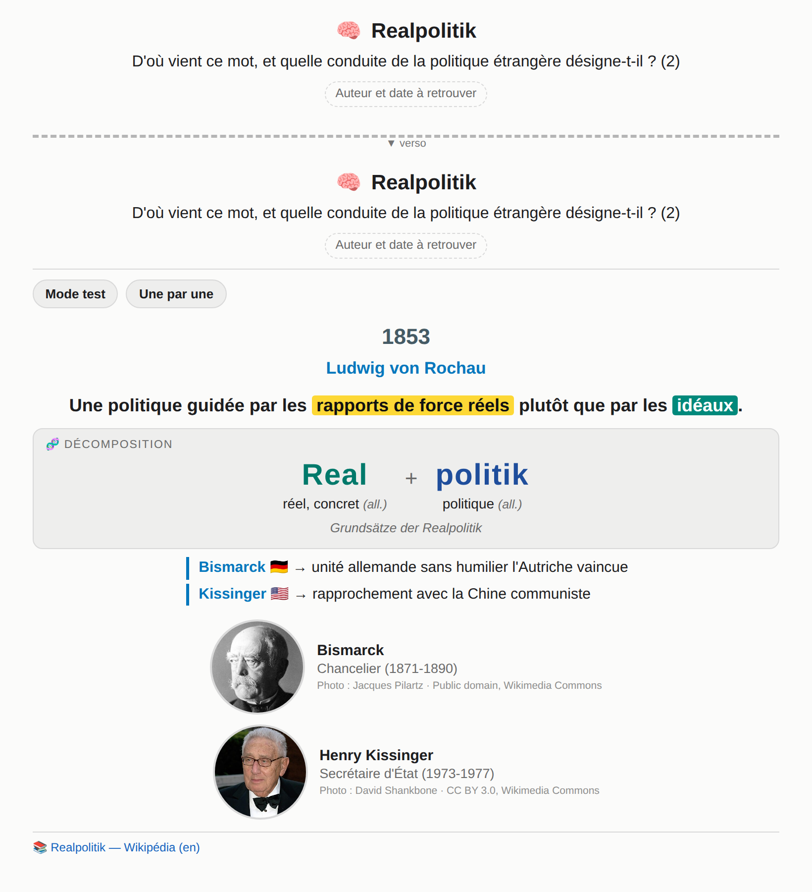
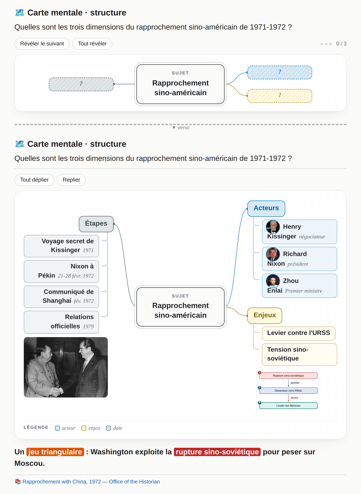

# Ficher — des flashcards Anki soignées, générées par Claude à partir de tes cours

Tu donnes un cours, un chapitre, un article ou une actualité à Claude. Il en tire des cartes Anki
**courtes, colorées et visuelles** et te rend un fichier `.apkg` : double-clic, c'est dans Anki.

<p align="center">
  
  
</p>

Gratuit et open source (licence MIT). Pense à relire les cartes : Claude vérifie les faits sur le web
et cite ses sources au verso, mais il peut se tromper.

## Ce que font les cartes

- **Une idée par carte** : une question, une réponse centrale, 2 à 4 puces, au plus deux encarts
  (piège, lien, moyen mnémotechnique, anecdote).
- **Code couleur** en 13 catégories (risque, économie, politique, acteur, concept…), en mode clair
  comme en mode sombre.
- **16 familles de schémas** dessinés automatiquement : chaîne causale, frise, matrice, courbe,
  balance, cartes géographiques réelles (avec une version muette pour s'entraîner à localiser)…
- **Cartes mentales à rappel actif** : une carte pour retrouver les axes, puis une carte par branche.
- **Plusieurs façons de réviser** : texte à trous, réponse à taper (avec tolérance des variantes et
  bouton « Lettre suivante »), curseur d'estimation « Combien ? », citations à trous, occlusion
  d'image, mode test et révélation « une par une ».
- **Portraits et images** tirés de Wikipédia et Wikimedia Commons, avec leur crédit.
- **Langues** : chinois (tons en couleur), espagnol, arabe égyptien, polonais, avec cartes d'écoute,
  de lecture et de production, et audio.
- **Anti-doublon** : si tu réimportes une carte corrigée, elle remplace l'ancienne sans effacer ta
  progression.

## Installation (10 minutes, une seule fois)

Il te faut [Anki](https://apps.ankiweb.net) et un compte [Claude](https://claude.ai) qui permet de
créer des **Projets** et d'exécuter du code (vérifie que « exécution de code et création de
fichiers » est activée dans les paramètres de Claude).

1. **Télécharge ce dépôt** : bouton vert « Code » → « Download ZIP », puis décompresse.
2. **Importe le paquet de démarrage** `paquets/Ficher_demarrage.apkg` dans Anki (double-clic).
   Il installe les types de note « Ficher » et te montre 11 cartes d'exemple.
3. **Crée un Projet dans Claude** (par exemple « Flashcards ») et ajoute-lui ces fichiers :
   - les 7 scripts du dossier `moteur/` ;
   - `prompts/socle.md` ;
   - le ou les modules de ta filière, dans `prompts/modules/`.
4. **Colle la consigne** de [`prompts/consigne_projet.md`](prompts/consigne_projet.md) dans les
   « Instructions » du projet.
5. **Teste** : ouvre une conversation dans le projet, joins un chapitre de cours (PDF, diapositives,
   texte) et écris « fais-moi des flashcards ». Claude annonce le nombre de cartes, construit le
   paquet et te le livre.

## Modules disponibles

| Module | Pour |
|---|---|
| `module_geopolitique.md` | HGG, ESH, Sciences Po, relations internationales, actualité |
| `module_ecole_de_commerce.md` | finance, stratégie, économie, marketing, RH, négociation |
| `module_langues.md` | chinois, espagnol, arabe égyptien, polonais (et d'autres à ajouter) |
| `module_concours_insp.md` | concours de l'INSP (droit public, finances publiques, QRC…) |

Ta matière n'y est pas ? Copie [`_modele_de_module.md`](prompts/modules/_modele_de_module.md) et
remplis-le : types de carte, sens des couleurs dans ta matière, schémas utiles, sources. Partage-le
ensuite sur le Discord ou propose-le ici (pull request) pour que d'autres en profitent.

## Portraits et images

Claude télécharge les photos depuis Wikipédia. Dans certains environnements, il n'a pas accès au
réseau. Si des portraits manquent, lance cette commande dans le dossier des cartes :

```bash
python3 portraits.py cartes.json
```

puis demande à Claude de reconstruire le paquet. Si ton ordinateur est relié à Claude (application
de bureau), Claude peut la lancer lui-même.

## Utiliser le moteur sans Claude

Le moteur est un simple script Python : il transforme un fichier `cartes.json` en paquet Anki.

```bash
pip install -r requirements.txt
cd exemples
python3 ../moteur/build_apkg.py cartes_demo.json -o demo.apkg --preview apercu
```

`--preview apercu` produit un aperçu HTML de chaque carte, en clair et en sombre. Le format du JSON
est décrit en tête de `moteur/build_apkg.py` et dans `prompts/socle.md` (§10).

## Bonnes pratiques

- **Fais tes cartes à partir de tes propres fiches ou de ton cours**, pour toi. Ne partage pas des
  paquets qui reprennent tel quel le polycopié d'un professeur ou un manuel protégé.
- Garde la même ancre quand tu corriges une carte : Anki la met à jour au lieu d'en créer une autre.
- Commence sobre : on enrichit plus tard les cartes qu'on rate souvent.

## Communauté

Entraide à l'installation, idées et paquets partagés par filière : rejoins le **Discord Ficher**
(lien dans la description du dépôt).

## Licence

MIT, voir [LICENSE](LICENSE). Les portraits et images d'exemple viennent de Wikimedia Commons ; leur
auteur et leur licence sont dans `exemples/portraits/credits.json` et affichés sur chaque carte.
